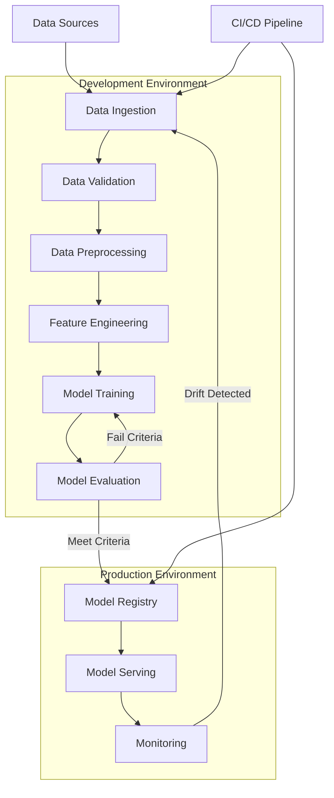

# 🚀 MLOps Project

<div align="center">


[](LICENSE)
[](https://www.python.org/)
[](https://www.tensorflow.org/)
[](https://pytorch.org/)

**A comprehensive MLOps pipeline for streamlined machine learning operations**

[Overview](#overview) • 
[Architecture](#architecture) • 
[Installation](#installation) • 
[Usage](#usage) • 
[Features](#features) • 
[Contributing](#contributing) • 
[License](#license)

</div>

## 📋 Overview

This MLOps project implements a complete machine learning operations pipeline, enabling efficient development, deployment, and monitoring of machine learning models. The system streamlines the entire ML lifecycle from data ingestion to production monitoring.

## 🏗️ Architecture

Below is the architecture diagram of our MLOps pipeline:



## 🔧 Installation

```bash
# Clone the repository
git clone https://github.com/yourusername/mlops-project.git
cd mlops-project

# Create virtual environment
python -m venv venv
source venv/bin/activate  # On Windows: venv\Scripts\activate

# Install dependencies
pip install -r requirements.txt
```

## 🚀 Usage

```bash
# Configure the pipeline
python setup.py configure

# Run the data ingestion process
python pipeline/ingestion.py --source data/raw

# Train a model
python pipeline/train.py --config configs/model_config.yaml

# Evaluate model performance
python pipeline/evaluate.py --model-path models/latest

# Deploy the model
python pipeline/deploy.py --model-name latest --version 1.0
```

## ✨ Features

- **Automated Data Ingestion**: Streamlined data collection from multiple sources
- **Data Validation & Preprocessing**: Ensures data quality and transforms raw data
- **Experiment Tracking**: Version control for both data and models
- **Model Versioning**: Keep track of all model iterations
- **Continuous Integration/Deployment**: Automated testing and deployment
- **Model Monitoring**: Real-time performance monitoring and drift detection
- **Auto-scaling Inference Service**: Handles variable production loads efficiently

## 📁 Project Structure

```
mlops-project/
├── configs/              # Configuration files
├── data/                 # Data storage (gitignored)
│   ├── raw/              # Raw data
│   └── processed/        # Processed data
├── docs/                 # Documentation
├── models/               # Saved models
├── notebooks/            # Jupyter notebooks for exploration
├── pipeline/             # Core pipeline components
│   ├── ingestion.py      # Data ingestion scripts
│   ├── preprocessing.py  # Data preprocessing scripts
│   ├── training.py       # Model training scripts
│   ├── evaluation.py     # Model evaluation scripts
│   └── deployment.py     # Model deployment scripts
├── monitoring/           # Monitoring infrastructure
├── tests/                # Unit and integration tests
├── utils/                # Utility functions
├── .gitignore            # Git ignore file
├── requirements.txt      # Project dependencies
└── README.md             # Project README
```

## 👥 Contributing

Contributions are welcome! Please feel free to submit a Pull Request.

1. Fork the repository
2. Create your feature branch (`git checkout -b feature/amazing-feature`)
3. Commit your changes (`git commit -m 'Add some amazing feature'`)
4. Push to the branch (`git push origin feature/amazing-feature`)
5. Open a Pull Request

## 📄 License

This project is licensed under the MIT License - see the LICENSE file for details.
